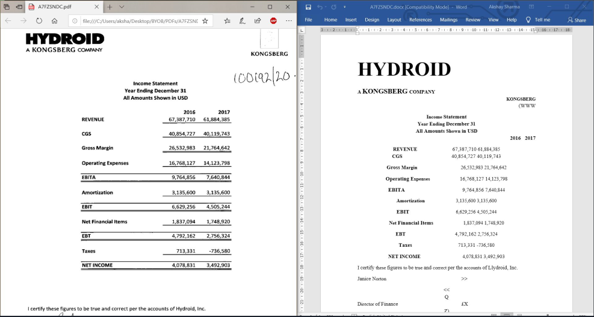
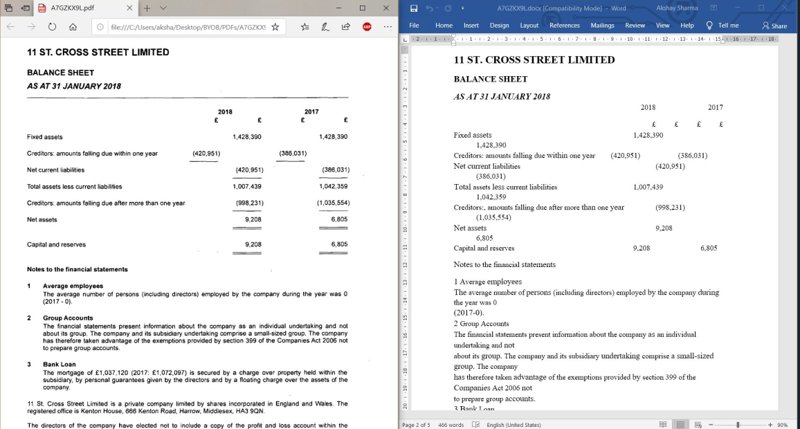
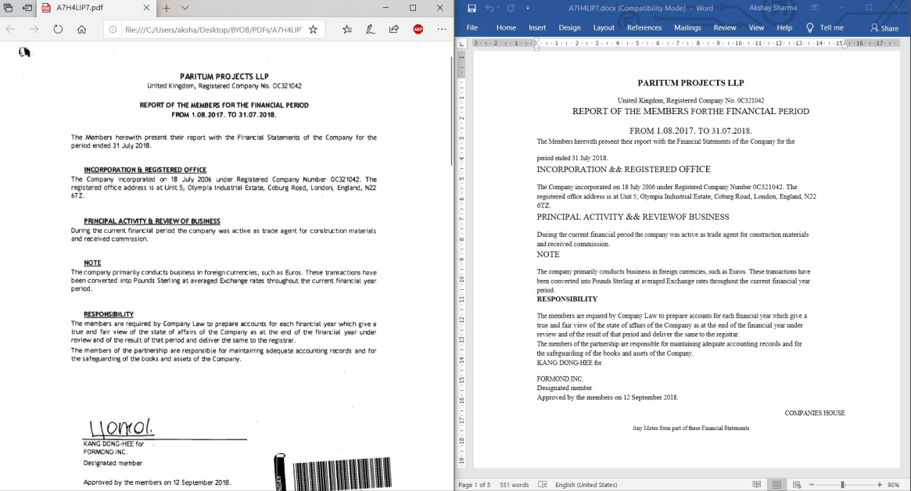

# OCR Denoising for digitalized PDF documents

This repository contains python 3.6.x scripts for OCR task for digitalized PDF docs. It uses PDF redering library poppler for converting PDF files to DOCx files via intermiate XML file generation. Our claim, It gives better result that OOB Tesseract for digitized PDF documents.

Few example files are also uploaded on which intial tests were carried out along with their `words.txt` file which contains lists of some `nouns` that are present in sample test file. Refer feature section for more details.

Also, it doesn't handle OCR reading from images which Tesseract can do and very good at.

# How to Run 

* In already existent directory named `PDF` add the desired PDF files that are needed to be converted. Make sure its empty.
* Linux v/s Windows Instructions, Things to be sure of:
  ```
  In main.py file, go to line 63 and make the following changes.
  
  For Linux Systems Use:
  file = file.split("/")[-1]
  
  And For Windows Systems Use:
  file = file.split("\\")[-1]
  
  BTW our personal favorite is linux platform.
  ```

* Install pre-requisites with following commands.
  ```
  # Installing PDF rendering utility tools for linux. For Windows, binaries are available on platforms like sourceforge.net etc.
  sudo apt-get install -y poppler-utils
  
  # If using windows/linux make sure pip or pip3(for linux) is installed on your machine.
  
  pip3 install -r requirements
  
  # Just make sure pyspellchecker and python-docx are install beforehand.
  ```

* Run the following command for creating corresponing word documents `python3 main.py`.

# Executing with a Docker Image via Dockerfile

* Make sure docker is running beforehand. Or simply execute `systemctl start docker` .
* Make currrent directory as your `pwd` and then type following command ` sudo docker build -t ocrtest:1.0 . ` for executing given Dockerfile. 
* After every dependency is downloaded. Check that your given image exists with `docker images` command.
* Then run your given image with `docker run -i -t IMAGE_ID(NUMERIC)` command.
* Bash shell for given image will start with all the pre-requisites installed.

# Important Features

* Multiprocessing, adds a batch of files to different cores of CPU. Also, this software relies on capabilities OS to manage and distribute different processes.
* Checking capabilities varies with use-case leading to more flexibility.
* Extended design, along with extensive testing more frequent errors can be added and maintained to achieve better results. It checks numerical errors, wrong spellings, wrong characters, currency symbols (math symbols not added, addition scope possible)  for carrying out effective OCR Denoising.

# How to achieve better results

This is the manual part, it has been left manual. So, that best results can be achieved depending on specific use-case.

* {Automation Scope Possible} Adding nouns to `words.txt`, these may be correct but our spellchecker might find an alternative resulting in a False-Postive. Hence, maintaining a list of most frequent nouns will give accurate results. You can refer to a sample file in current repository.
  * Scope of automation for this step is possible to some extent with any POS tagger being runned on intermediate XML file as a pre-processing step. We found that choice to be limiting and inflexible as per our discussion and test. Hence, decided to make it manual.
* Adding more tuples to `erroneous` dictionary along the way of your testing procedure. Only, add complete small words upto 4 characters which are wrongly detected. Contributions are welcomed.
* Adding more tuples to `trial` dictionary along the way of your testing procedure. Add most frequent wrongly detected characters in a word as it will get replaced with a recursive function and checked with a spellchecker algorithm for corresponding correct word.  Contributions are welcomed.
* Adding more tuples to `numericalErrors` dictionary along the way of your testing procedure. Add most frequent wrongly detected numerical characters. Contributions are welcomed.
* Adding more items to `currency` list depending on your use-case. 

# Result

* Subfolders with same name as that of given PDF files are created in the DOCX directory. These folder holds the generated docx file for each respective PDF provided. 
* Corresponding XML files folders also gets created for given PDF files. It contains images of digital PDF documents. If needed to be analyzed, it can be added.  
  
| Example 1 | Example 2 | Example 3 |
|   :---:   |   :---:   |   :---:   |
|  |  |  |
